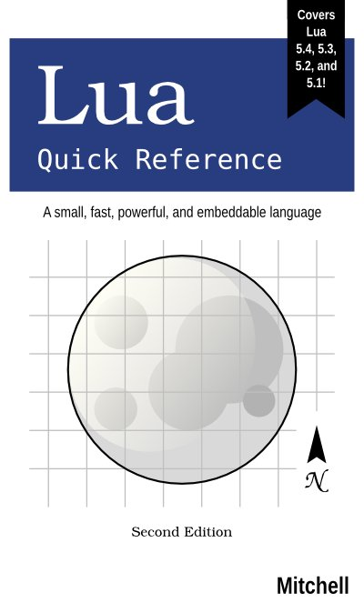

  

*Lua Quick Reference* 
Second Edition

Order the <a href="https://gum.co/luaqr" target="_blank">e-book</a> -- $20
USD 
Order the print book on Amazon [US][], [CA][], [UK][], [DE][], [FR][], [IT][],
[ES][] -- ~$28 USD 

Published: May 2020 
ISBN: 978-0-9912379-5-1 
Pages: 169

Read an [excerpt][]. Download the [source code examples][].

Lua is a small, fast, powerful, and embeddable scripting language. It is
well-suited for use in video games, application scripting, embedded devices, and
nearly anywhere else a scripting language is needed. This quick reference
contains a wealth of knowledge on how to program in and embed Lua, whether it is
Lua 5.4, 5.3, 5.2, or 5.1. This book can even be used with LuaJIT, a
Just-In-Time compiler for Lua based on Lua 5.1. *Lua Quick Reference* groups the
language's features and C API in a convenient and easy-to-use manner, while
clearly marking the differences between Lua versions.

This book covers:

* Lua syntax, expressions, and statements
* Metatables and metamethods
* Object-oriented programming with Lua
* Creating and working with Lua and C Modules
* Lua's standard library and its C API
* Collaborative multi-threading in Lua and C
* How to embed and use Lua within a host
* And much more

Mitchell commands over 15 years of experience programming in and embedding Lua
in both the corporate and open-source realms.

[US]: https://www.amazon.com/dp/0991237951
[CA]: https://www.amazon.ca/dp/0991237951
[UK]: https://www.amazon.co.uk/dp/0991237951
[DE]: https://www.amazon.de/dp/0991237951
[FR]: https://www.amazon.fr/dp/0991237951
[IT]: https://www.amazon.it/dp/0991237951
[ES]: https://www.amazon.es/dp/0991237951
[excerpt]: https://github.com/orbitalquark/lua-quick-reference/blob/default/docs/excerpt.pdf
[source code examples]: https://github.com/orbitalquark/lua-quick-reference

## Table of Contents

* Introduction ([excerpt][])
  + Download
  + Code Editors
  + Conventions
  + Terminology
  + Environment Variables
* Command Line Options

* Part I: The Lua Language ([excerpt][])
  + Fundamentals
  + Comments
  + Identifiers and Reserved Words
  + Variables and Scopes
  + Types
    - Nil
    - Booleans
    - Numbers
    - Strings
    - Functions
    - Tables
    - Threads
    - Userdata
    - Perform Basic Value Operations
  + Expressions and Operators
    - Arithmetic Operators
    - Relational Operators
    - Logical Operators
    - Bitwise Operators
    - Other Operators
  + Statements
    - Variable Assignment
    - Control Structures
    - Labels and Goto
  + Functions
    - Functions with Variable Arguments
  + Metatables and Metamethods
    - Assign and Retrieve Metatables
    - Arithmetic Metamethods
    - Relational Metamethods
    - Bitwise Metamethods
    - Closing Metamethod
    - Other Operator and Statement Metamethods
    - Function Metamethods
    - Bypass Metamethods
  + Object-Oriented Programming
    - Define a Class
    - Utilize a Class
  + Modules
    - Create a Lua Module
  + Environments
  + Error Handling and Warnings
  + Load and Run Dynamic Code
  + Numeric Facilities
    - Trigonometric Functions
    - Exponential and Logarithmic Functions
    - Generate Random Numbers
    - Work with Integers
  + String Facilities
    - Create a Compound String
    - Query and Transform Strings
    - Search and Replace Within a String
    - Work with UTF-8 Strings
  + Table and List Facilities
    - Iterate Over a Table
    - Manipulate Lists
    - Unpack Lists
    - Create Strings from Lists
  + Thread Facilities
    - Create a Thread
    - Start, Resume, and Yield a Thread
    - Query Thread Status
  + Input and Output Facilities
    - Simple Input and Output
    - Object-Oriented Input and Output
    - Manage Files
    - Start and Interact with a Process
  + Operating System Facilities
    - Dates and Times
    - Locale Settings
  + Memory Management
  + Miscellaneous

* Part II: The Lua C API
  + C API Introduction ([excerpt][])
    - Compiling Lua Programs
  + The Stack
    - Increase Stack Size
    - Work with Stack Indices
    - Push Values
    - Pop Values
    - Query Values
    - Retrieve Values
  + Basic Stack Operations
    - Element Operations
    - Global Variable Operations
    - Arithmetic Operations
    - Relational Operations
    - Bitwise Operations
    - String Operations
    - Table Operations
    - Length Operations
    - Reference Operations
  + C Functions
    - Define a C Function
    - Register a C Function
    - Call a C Function
  + Metatables
    - Create or Fetch a Metatable
    - Assign a Metatable
    - Retrieve a Metatable
    - Metamethods and Metafields
  + C Modules
  + Error and Warning Handling
    - Retrieve Error Information
  + Load and Run Dynamic Code
  + Threading in C
    - Create a Thread
    - Start or Resume a Thread
    - Yield a Thread
    - Transfer Values Between Threads
    - Query a Thread’s Status
    - Call a Function that Yields
  + Memory Management
  + Miscellaneous

* Lua API Index
* Concept Index ([excerpt][])

[excerpt]: https://github.com/orbitalquark/lua-quick-reference/blob/default/docs/excerpt.pdf

## Errata

None reported.
